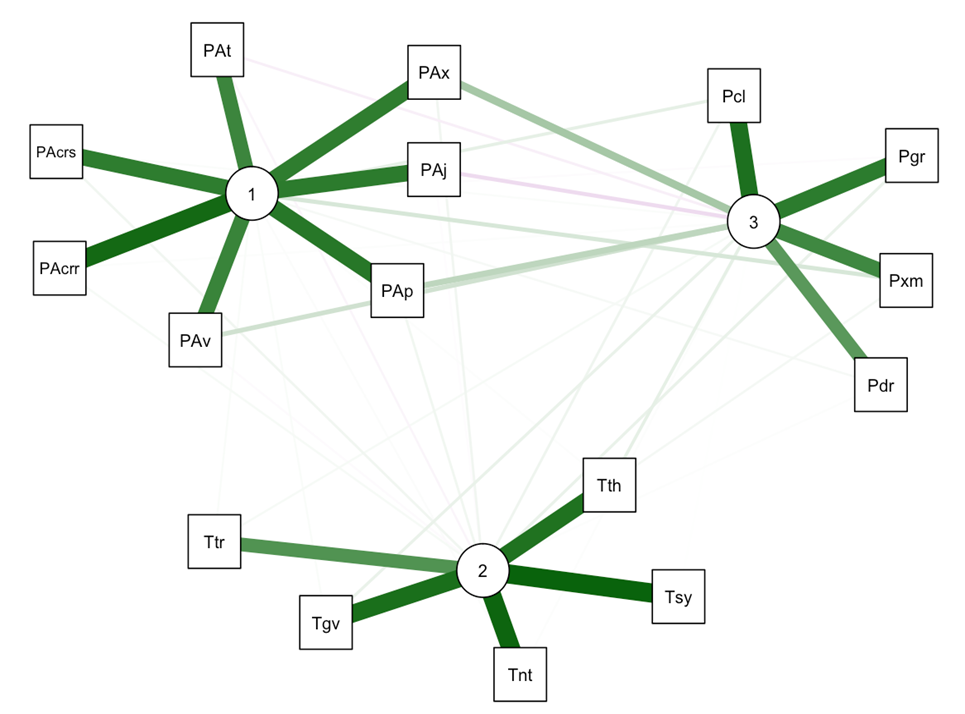
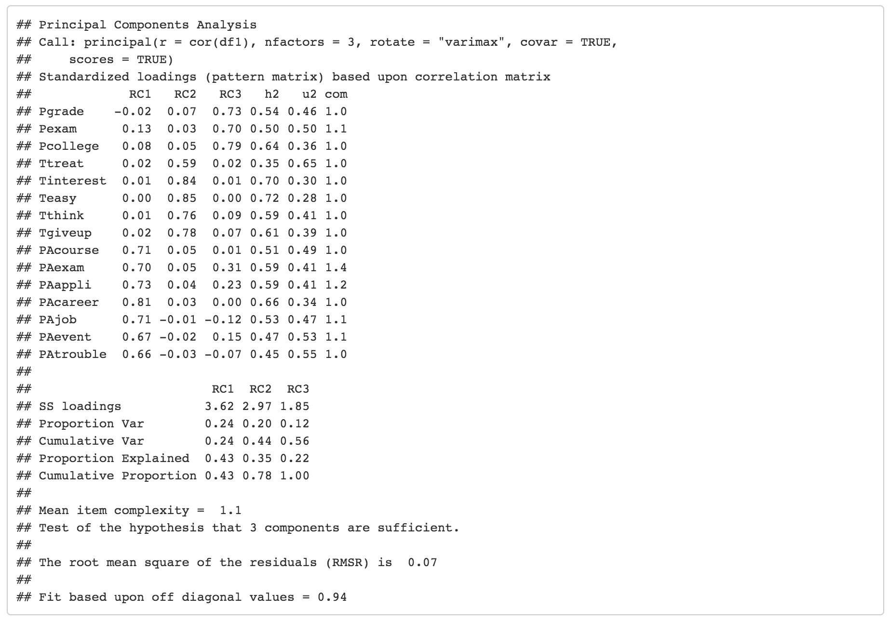
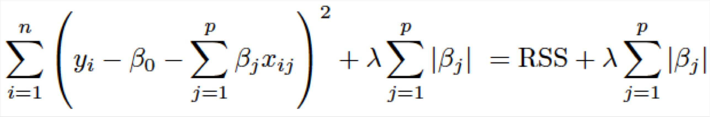

```{r setup, include=FALSE}
knitr::opts_chunk$set(echo = FALSE, warning = FALSE, message = FALSE, tidy=TRUE, useBytes = TRUE)
#Sys.setlocale('LC_ALL','C')
#install and load required packages
loadPkg = function(x) { if (!require(x,character.only=T, quietly =T)) { install.packages(x,dep=T,repos="http://cran.us.r-project.org"); if(!require(x,character.only=T)) stop("Package not found") } }
```
```{r results='hide'}
loadPkg("readxl")
loadPkg("dplyr")
loadPkg("gmodels")
loadPkg("corrplot")
loadPkg("ResourceSelection")
loadPkg("pscl")
loadPkg("bestglm")
loadPkg("car")
loadPkg("glmnet")
loadPkg("pROC")
loadPkg("rpart")
loadPkg("rpart.plot")
loadPkg("randomForest")
loadPkg("psych")
loadPkg("qgraph")
loadPkg("factoextra")
loadPkg("ggplot2")
loadPkg("Rcpp")
loadPkg("data.table")
loadPkg("RColorBrewer")
loadPkg("plotly")
loadPkg("faraway")
```
##Chapter 1: Introduction  
This study shows how does the educational and social experiences affect different paths of student’s life especially in this case we are focused on the high school performance of the student. High school performance of the student reveals many aspects of their future life choices for example whether they will attend college or not, what kind of jobs and salary they will get. All these future choices are affected by the various factors which are the part of the student’s life. Based on the MaryBeth Walpole (2003) study, low socioeconomic status of the student affects its extracurricular activities, GPA, and study performance compared to its peers of high socioeconomic status. As a result, these low socioeconomic students get lower income, education attainment, and support in life. A similar study was done by Debbie Hahs-Vaughn (2004) where they studied the impacts of parent’s education on the students. First generations students whose parents didn’t attend college faced hurdles in GPA, entrance exams and aspiration for higher education. Studying factors which can affect the student’s performance in high school can provide guidance to the parents and students itself in shaping their future. Good high school performance can help the student to get into better school with a scholarship, opens the door for better future opportunities, build a better social life by earning respect from teachers and peers and it also boosts the confidence of the student to face the hurdles in their life.  

##Chapter 2:Statistic analysis  
###Principal Component Analysis (PCA)  
Principal Component Analysis (PCA) is a useful technique for reducing a large number of variables (i.e., survey items) into a smaller set of factors. In the current research, a "wide" dataset with many variables is used to explore the high school students' performance and their future predictions. Therefore, PCA was conducted first to identify the underlying structure in the data.  
We select 15 variables from the original data set to do the component analysis. 
```{r for PCA & factor analysis 1}
#import the data
df1 <- read_excel("project2_data.xlsx", sheet = "pca")
#subset the data
df_pca <- subset(df1, select= Pgrade:PAtrouble)
#change all missing value to "NA"
df_pca[df_pca == -9] <- NA
#drop all missing value
df_pca <- na.omit(df_pca)
str(df_pca)
```
```{r}
#make the correlation plot
#corrplot(cor(df_pca), method="ellipse")
corrplot(cor(df_pca), method="color")
```

The original correlation plot demonstrates that most items have some correlation with each other.   

```{r}
#make the correlation network plots
qgraph(cor(df_pca))
```

Correlation network plots were conducted to illustrate the strength and sign of the correlations between each pair of variables.   

```{r}
#make the relative correlation plot
qgraph(cor(df_pca), layout="spring", shape="rectangle", posCol="darkgreen", negCol="darkmagenta")
```

The relatively high correlations among items would be a good candidate for PCA and factor analysis. After rearranging this correlation plot, there are three highly correlated item clusters, indicating these items’ interrelationships can be broken down into three components.

```{r for PCA & factor analysis 2}
#find the important PCA components
PCA <- prcomp(df_pca, center = TRUE,scale. = TRUE)
summary(PCA)
fviz_eig(PCA)
```

Sixteen principal components were obtained. Each of these explains a percentage of the total variation in this dataset. PCA output table and bar chart show that PC1 explains 24% of the total variance, PC2 explains 20% of the variance, and PC3 explains 11% of the total variance, respectively. These three components explain about 55% of the variance. A solution accounts for 55% of the total variance, which is not very high, but in the social science research, where information is often less precise and extracted factors usually explain only 50% to 60%. Therefore, it is common to consider a solution that accounts for 55% of the total variance as satisfactory (Hair, J. F., 2014).  

```{r for PCA & factor analysis 3}
#make the biplot between PC1 and PC2
biplot(PCA, col=c("black","red"), cex=c(0.7,0.8))
```
The clyster graph illustrates which items are similar to one another. For example, all teachers’ items cluster together at the top. This makes sense, as all of these items are related to students’ perception of teacher support.


```{r for PCA & factor analysis 4}
#plot the variance using the sd
#screeplot(PCA)
plot(PCA,type="lines")
```

One criterion is the chosen components that have eigenvalues greater than 1. The scree plot confirms that the first three components have an eigenvalue greater than 1. Therefore, the three component solution is plausible for this study.


```{r for PCA & factor analysis 5}
#loadings(PCA)
#qg.pca <- qgraph.pca(df_pca, factors=3, rotation="none")
#qgraph(qg.pca, posCol="darkgreen", layout="spring", negCol="darkmagenta", edge.width=2, arrows=FALSE)
#pca.rot <- principal(r = cor(df_pca), nfactors=3, rotate="varimax",scores=TRUE,covar = TRUE)
#pca.rot
#qg.pca <- qgraph(pca.rot)
#qgraph(qg.pca, posCol="darkgreen", layout="spring", negCol="darkmagenta", edge.width=2, arrows=FALSE)


#above code are used to make the plot and compute the table below. We original run the code it works well. But when we run it now, as the package version updated. the function qgraph.pca is removed from qgraph package. so it does not work. we also attached a copy of the original html for the pca part which shows this part can run correctly.


#insert the plot above code should run. 


```

In the factor analysis, the unobserved or latent variable that makes up common variance is called a factor. The factor analysis plot demonstrates that there are three very clear underlying structures of these 16 items. All parent items are loaded in factor 1, all teacher items are loaded in factor 2, and all peer items are loaded in factor 3, and hence the factor 1 was named parental involvement, factor 2 was named students’ perception of their teachers, and factor 3 was named peer influence.

Form the factor loading table, all observed items loadings are larger than .5. A high value of factor loading represents high convergent validity.  
In the last step, factor scores for these three latent factors were generated for the following analysis.

```{r results='hide'}
#import the data
df_lasso <- read_excel("project2_data.xlsx", sheet = "Q1")
#check the data structure
str(df_lasso)
```

###SMART QUESTION 1: What factors determine whether students go to college or not?
One of the most significant and challenging decisions you will ever make is whether or not to go to college(Mckay.D.R.,2019). The decision may be influenced in many ways. Someone choose to go to college may because their parents tell them to do, or may because their friends all do, and someone chooses not to go to college may because they cannot afford it, or they do not get admitted. Here, we try to find what factors will influence a students decision to go to college, and what are the most important ones?

- ####**Data cleaning**

To build the model, we select 25 variables from the raw data as independent variables, and one categorical variable as the dependent variable. Replace all missing value by "NA", and remove all the "NA" rows. For the dependent variables, there are multi-levels given the reasons that students are not enrolled in college, so we set all these reasons as not enroll by integer 0, and set enroll by 1.      
Then we change categorical variables' data type to factor and rename the columns name for easy understanding. Figure below shows the final data structure. We have a total of 8 numeric variables and 18 factor variables.     
```{r}
#subset the data by column name
df_clean <- subset(df_lasso, select = X1TXMTSCOR:X4FB16ENRSTAT)
#change different type of missing value to NA.
df_clean[df_clean == -1] <- NA
df_clean[df_clean == -7] <- NA
df_clean[df_clean == -8] <- NA
df_clean[df_clean == -9] <- NA
#set the Y variable level to enroll=1, not enroll=0
df_clean$X4FB16ENRSTAT <- ifelse(test = df_clean$X4FB16ENRSTAT == 1, yes = 1, no = 0)
#remove all missing values
df_clean <- na.omit(df_clean)
#set the data used to do the correlation plot later
data_corr <- df_clean
```
```{r}
#change all the categorical variable to factor type.
df_clean$X1RACE <- as.factor(df_clean$X1RACE)
df_clean$X2DUALLANG <- as.factor(df_clean$X2DUALLANG)
df_clean$X1TXMQUINT <- as.factor(df_clean$X1TXMQUINT)
df_clean$X1MOMEDU <- as.factor(df_clean$X1MOMEDU)
df_clean$X1MOMEMP <- as.factor(df_clean$X1MOMEMP)
df_clean$X1MOMOCC2 <- as.factor(df_clean$X1MOMOCC2)
df_clean$X1MOMRACE <- as.factor(df_clean$X1MOMRACE)
df_clean$X1DADRACE <- as.factor(df_clean$X1DADRACE)
df_clean$X1TMRACE <- as.factor(df_clean$X1TMRACE)
df_clean$X1CONTROL <- as.factor(df_clean$X1CONTROL)
df_clean$X1LOCALE <- as.factor(df_clean$X1LOCALE)
df_clean$X1REGION <- as.factor(df_clean$X1REGION)
df_clean$X1DADEDU  <- as.factor(df_clean$X1DADEDU)
df_clean$X1DADEMP  <- as.factor(df_clean$X1DADEMP)
df_clean$X1DADOCC2  <- as.factor(df_clean$X1DADOCC2)
df_clean$X1TMCERT  <- as.factor(df_clean$X1TMCERT)
df_clean$X2SEX  <- as.factor(df_clean$X2SEX)
df_clean$X4FB16ENRSTAT <- as.factor(df_clean$X4FB16ENRSTAT)

#rename all the columns
colnames(df_clean)<- c("Mathscore_grade9","Mathscore_grade11","Race","NativeLanguage","Quintile_math_score_grade9","Mom_education","Mom_employment_status","Mom_occupation", "Mom_race", "Dad_education","Dad_employment_status","Dad_occupation", "Dad_race","Social_economic_status", "Math_teacher_race","Math_teacher's_certificate","School_Private/Public","School_Urban/City","School_State","Sex", "STEM_grade12_GPA","Math_grade12_GPA","PC1_parents_involvement","PC2_teahers_involvement","PC3_peer_influence","Attendcollege")
str(df_clean)
```
- ####**Discriptive analysis** 


```{r fig.height = 4, fig.width = 6, fig.align ='center'}
#plot the bar chart for student attend college after high school
ggplot(df_clean, aes(x=df_clean$Attendcollege)) +
  geom_bar(alpha = 0.5,  fill ="orange") +
  labs(title = "Whether attend college after high school", 
       x = NULL)+
  scale_x_discrete(labels=c("1" = "Attend college", "0" = "Didn't attend college"))
```

We first give an overlook at the dependent variable Attendcollege. The plot shows the student in our dataset attend college about twice as much as the student did not attend college.  
Then we give a correlation plot of all the 26 variables, the darker the point, the higher the correlation. So we can find there is multicollinearity between some of our variables. 
```{r fig.height=6, fig.width=6}
#check correlation between the variables
corrplot(cor(data_corr),tl.pos='n')
```

Lasso regression can deal with the multicollinearity issue, so we will use Lasso to make the variable selection.  

- ####**Lasso**(least absolute shrinkage and selection operator) 

First, let's review the Lasso equation. Lambda is the tuning parameter, and the part with Lambda is the shrinkage penalty. With the increase in Lambda, the coefficients beta will be shrunk to 0. This is the way how Lasso makes the feature selection.
```{r}
#insert the equation graph from local. 

```

We run the Lasso regression and get two plots. The first one is the coefficient plot, shows more and more coefficient of the independent variables are shrunk to zero with the increase in Log lambda.
```{r Lasso regression shrinkage variable selection}
#set x and y in lasso regression
x=model.matrix(Attendcollege~.,df_clean)[,-1]
y=df_clean$Attendcollege

#make the lasso coefficient plot
lasso_mod=glmnet(x,y,alpha=1,family="binomial")
plot(lasso_mod, xvar = "lambda", pch=19)
```

```{r Lasso find the best lambda}
#check the cross validation 
cv_lasso=cv.glmnet(x,y,alpha=1,family="binomial")
#check the best lambda and 1 standard error lambda
bestlam=cv_lasso$lambda.1se
bestlam1=cv_lasso$lambda.min
```
The second plot is the cross-validation plot, which shows binomial deviance of the log Lambda, the lower the deviance the better, the left dash line pass the minimum deviance point, where the Lambda is `r round(bestlam,2)`, the right dash line is one standard error larger than the minimum point. Commonly, the area between the dash lines is good to select. As we do not want to involve too many variables in our model, we use the right line point where the Lambda is about `r round(bestlam1,2)` to select the variables. The axis on the top indicate at this point there are six variables left, and all the other variables have been shrunk to 0.     
```{r}
#plot the cross validation plot
plot(cv_lasso)
```

By selecting variables coefficient not equal zero, we get the listed six variables:  
```{r find the variables selected}
#check the coefficient of the variables at 1 standard error point
lasso_coef <- coef(cv_lasso, s = "lambda.1se")
#select the variables with coefficient not equal to zero
selected_variable = which(lasso_coef != 0)
#select the index of the variables
variable_index = selected_variable[-1]-1 
#list the column name of the selected variables
varibale_name = colnames(x)[variable_index]
varibale_name
```
As coefficient shrunk is in Lasso, it is not the original number, we need to conduct a Logistic regression to confirm the actual coefficient number of the six variables.

- ####**Logistic regression**  
```{r}
#generate the logistic regression
adjustLogit <- glm(Attendcollege ~ Mathscore_grade11+Mom_education+Social_economic_status+Sex+STEM_grade12_GPA+PC3_peer_influence, data = df_clean, family = "binomial")
summary(adjustLogit)
```
```{r}
exp(coef(adjustLogit))
```
From the output we can see, the variables are significant. Then, we produce a Log Odd, by taking the exponential of the coefficients, for every unit increase in STEM GPA the odds-ratio of attend college is multiplied by 2.74, and for mother's education is level 4, the odds-ratio of attending college is multiplied by 3.08.
And we can conclude, **STEM_grade12_GPA** and **Mom_education** are more critical than other variables when making the prediction. 

- ####**Model evaluation**
```{r}
#plot the ROC curve
prob <- predict(adjustLogit, type = c("response"))
df_clean$prob <- prob
plot.roc(Attendcollege ~ prob, data = df_clean, col = "green3", lwd=4, print.auc = TRUE)
```

We use the ROC curve to do the model evaluation, and the area under the curve is about 83%, which indicate our six variables model is a very good model.    

Below, we also use the Random forest and Decision tree to run the same model with the six variables and make a comparison between the three results.  

- ####**Random Forest Model**
Random Forest is one of the most widely used machine learning algorithms for classification. The best part of the algorithm is that there are very few assumptions attached to it, so data preparation is less challenging and results in time-saving(Bhalla.D).
```{r fig.height=5, fig.width=10}
#run the random forest model
rf <- randomForest(Attendcollege ~ Mathscore_grade11 + Mom_education + 
    Social_economic_status + Sex + STEM_grade12_GPA + PC3_peer_influence, data= df_clean,importance=TRUE)
# Model output
print(rf) 
```
We use the default number of tree 500, and as we only have 6 variables, our best split is 2.
Out of bag data is equivalent to test data, each tree is tested on the 1/3rd of the samples not used in building that tree. So we can estimate the accuracy of the model through the out of bag error. The accuracy rate is about 77%. And from the confusion matrix, we can find, the 0 class error is a little bit higher, this may because of the total samples in 0 class is about half less than samples in class 1.  

```{r}
#find the important variables
varImpPlot(rf, type=1)
```

Mean Decrease Accuracy is how much the model accuracy decreases if we drop that variable.
Higher the value of mean decrease accuracy, higher the importance of the variable in the model(Bhalla.D.). In the plot shown above, STEM GPA is the most essential variable, and PC3 peer performance is the second.

- ####**Classification tree**

The decision tree is a visualized method, and it is easy to understand. We usually build a tree first and then optimize the tree. Finally, we can use the test data to check accuracy. Here, we again use the six variables to build the decision tree.
```{r fig.height=5, fig.width=10}
#select the datas used to build the tree
tree_df <- df_clean[c("Attendcollege", "Mathscore_grade11", "Mom_education", "Social_economic_status", "Sex", "STEM_grade12_GPA", "PC3_peer_influence")]

#random select datas into train and test groups
set.seed(1000)
train.index <- sample(x=1:nrow(tree_df), size=ceiling(0.8*nrow(tree_df) ))
train <- tree_df[train.index, ]
test <- tree_df[-train.index, ]

#use train data to run the classification tree
fit <- rpart(Attendcollege ~ ., method="class", data = train)
# plot tree 
rpart.plot(fit, type = 3, digits = 3, fallen.leaves = TRUE)
```
This is the tree we growth. To optimize the tree and find the important factors, we use the complexity parameter(cp). Here we draw a plot, and we choose the cp with the lowest x-error.
```{r}
#printcp(fit) # display the results 
plotcp(fit) # visualize cross-validation results 
```
```{r}
#prune the tree 
pfit <- prune(fit, cp = fit$cptable[which.min(fit$cptable[,"xerror"] ),"CP"])

#plot the pruned tree 
rpart.plot(pfit, type = 3, digits = 3, fallen.leaves = TRUE)
```

From the pruned tree we can find STEM GPA higher than 2.25 students will go to college, if GPA is lower than 2.25 then we need to look at the mother's education if the mother has a higher education level, the student will still go to college, if mother education is not high, the student will not go to college. 

```{r use test data to check accuracy}
#test data to predict the model
pred <- predict(fit, newdata=test, type="class")
table(real=test$Attendcollege, predict=pred)
```
```{r results= "hide"}
#calculate the accuracy
confus.matrix <- table(real=test$Attendcollege, predict=pred)
accuracy <- sum(diag(confus.matrix))/sum(confus.matrix)
```
Then we use the 20% test data to make a prediction. From the matrix we can see, the class 0 error is a little bit higher, this is also reflected in both the original tree and pruned tree. The reason is the unbias data between the two classes. However, the total accuracy rate of our model is good about `r round(accuracy*100,2)`%.

- ####**Comparison**
```{r}
#insert the equation graph from local. 
knitr::include_graphics("comparison.jpg")
```

Finally, we compare the three methods we used. The Logistic regression has the highest accuracy, Random forest, and decision tree almost the same, a little bit lower than Logistic regression. For the important variables we found, STEM GPA are both important in the three methods, and mother education is second important in Logistic regression and Decision tree, but for the random forest, peer influence is more important than mother education. 

###SMART Question 2: What are the responsible factors for income, when students start working?
In this research questons, we will seek to find out what are the responsible factors that has impact on student's future earning. We will make use of almost same variables data set to know the results for predicting the income.

```{r echo=FALSE, message=FALSE}
#Load in our data and create a dataframe
df_original <- read_excel("project2_data.xlsx", sheet = "Q2")
#str(df_original)

df_orig <- df_original
df_orig[df_orig == -1] <- NA
df_orig[df_orig == -7] <- NA
df_orig[df_orig == -8] <- NA
df_orig[df_orig == -9] <- NA


df_orig$X2LOCALE   <- as.factor(df_orig$X2LOCALE)
df_orig$X2REGION   <- as.factor(df_orig$X2REGION)
df_orig$X2DUALLANG   <- as.factor(df_orig$X2DUALLANG)
df_orig$X2MOMEDU   <- as.factor(df_orig$X2MOMEDU)
df_orig$X2DADEDU   <- as.factor(df_orig$X2DADEDU)
df_orig$X2FAMINCOME <- as.factor(df_orig$X2FAMINCOME)
df_orig$X2SEX <- as.factor(df_orig$X2SEX)
df_orig$X2RACE <- as.factor(df_orig$X2RACE)
df_orig$X3TGPAACAD <- as.factor(df_orig$X3TGPAACAD)
df_orig$X4INCOMECAT <- as.factor(df_orig$X4INCOMECAT)

#str(df_orig)
```

- ####**Data cleaning**

The following is the data structure of the subset for income prediction.The table consitute the INCOME_CAT as the Y variable as binomial. The y variables INCOME_CAT has been classified into two levels: Level 1 as income below $20,000 and Level 2 as income level above $20,000. The subset utilizes 16 independent variables of mixed datatype for predicting income of the students when they start working.   
```{r, echo=FALSE}
df_subset <- df_orig[c("X1TXMTSCOR", "X2LOCALE", "X2REGION", "X2DUALLANG", "X2MOMEDU", "X2DADEDU", "X2FAMINCOME" ,"X2SEX" ,"X2RACE","X3TGPAACAD", "X4INCOMECAT","X2SES", "X3TGPAMAT","X3TGPASTEM",  "FAC1_1" ,"FAC2_1",	"FAC3_1")]

df_subset <- na.omit(df_subset)

#Renaming the subset with meaningfull names
setnames(df_subset, old=c("X1TXMTSCOR", "X2LOCALE", "X2REGION", "X2DUALLANG", "X2MOMEDU", "X2DADEDU", "X2FAMINCOME" ,"X2SEX" ,"X2RACE","X3TGPAACAD", "X4INCOMECAT","X2SES", "X3TGPAMAT","X3TGPASTEM",  "FAC1_1" ,"FAC2_1",	"FAC3_1"), new=c("MATHscore_9th_grade", "LOCAL", "REGION", "NativeLanguage", "MOM_education", "Dad_education", "Family_Income" ,"SEX" ,"RACE","AllAcademic_grade_12_GPA", "INCOME_CAT","SES", "Math_grade_12_GPA","STEM_grade_12_GPA",  "PC1" ,"PC2",	"PC3"))

str(df_subset)
```
**Logistic Regression**is a predictive analysis to describe data and to explain the relationship between one dependent binary variable and one or more nominal, ordinal, interval or ratio-level independent variables. And, we know that the output is a probability that given input poin belong to a certain class. 

- ####**Logistic Regression**
```{r Logistic regression, echo=FALSE}
Income_Logistic <- glm(INCOME_CAT ~ ., data = df_subset, family = "binomial")

summary(Income_Logistic)
```
Here in the above summary result of the Logistic regression, we can find that there are so many insignificant variables in this whole complete model with all the variables as the regressors. So, we will do the model selection for choosing the best model with lower AIC value in comparion.  

- ####**Model selection**(backward stepwise selection method)
```{r, echo=FALSE}
backward <- step(Income_Logistic, direction = "backward")
```
Here, this backward stepwise selection method helped us to know the actual variables that cause the significant variance in the dependent variable. And, we can see that at sixth step we get the model with lower AIC in comparison and variables that are actually causing the significant variance in dependent variable INCOME. We will now again perform the glm() function to obtain the further model evaluations.  

```{r GOOD Fit Logistic regression, echo = FALSE}
Income_Logistic1 <- glm(INCOME_CAT ~ REGION + MOM_education + SEX + RACE + AllAcademic_grade_12_GPA + SES + Math_grade_12_GPA + PC1 + PC2 + PC3, data = df_subset, family = "binomial")

summary(Income_Logistic1)
```
**Exponetial coefficients** can also be checked for log odds. Regression coefficient describes the size and direction of the relationship between a predictors and the response variables.
```{r}
exp(coef(Income_Logistic1))
```
We can see that the exponetial coefficients for the independent categorical variable REGIONS2, REGIONS3, REGIONS4 are high among all other variables so prediction chances of higher and lower income of students, when they will start working can be categorized on the basis of region. The student in REGION 2 are having high chances of having high salaraies in comparison to students of REGION4.

- ####**Model evaluation**: McFadden  
```{r McFadden, echo=FALSE}
#calculate McFadden statistics for model evaluation
pR2(Income_Logistic1)
```
The pseudo R2 value is similar to the multi R-quare value as in linear regression for model's  maximum likelihood estimation. Here its coming out to be 10% which is not bad for this social science data where we are targetting people.

- ####**Model evaluation**: ROC curve and Area-Under-Curve

The AUC ROC curve is an important evaluation metrics for checking any classifcaion model's performance and can be said as Area Under the Receiver Operating Characteristics.
```{r roc_auc, echo=FALSE}
#make the ROC plot
prob_income <- predict(Income_Logistic1, type = c("response"))
df_subset$prob <- prob_income
plot.roc(INCOME_CAT~prob, data=df_subset, col = "red", lwd=4, print.auc = TRUE)
```

We can see that AUC value is coming 0.738 which is almost near 0.8 and is good for our kind od social science data set. We can accept it as good value for model validation and for predicting probability that student's income belongs to REGION variable as predictor.

##Conclusion
In conclusion, we find three underlying structures from PCA: parents involvement, students perception of teacher support, and peer influence. And we include these three factors in the attending college and graduate income analysis. The results indicate essential factors that influence student whether attend college are: Students Math score, mother education, family’s socioeconomic status, gender, STEM GPA, and peer’s performance. And essential factors that influence student income when they start working are Region, mother’s education, gender, socioeconomic status, final academic GPA of high school, teacher and peer’s performance. By analyzing the common important factors for the two research questions, we can summarize that family socioeconomic status, mothers education level, and peer’s performance is crucial in a student’s life.

##Limitation
There are some limitations to our project.
Our data is cross-sectional, it's hard to find causal assumption, so it is hard to determine the direction of influence using cross-sectional data. And our data is self-report data. There may contain social desirability bias when the respondent answers the question. Besides, there are some data is not accessible for the public. If we can get such kind of data from the organization, our analysis can be improved. 


##Bibliography
Hair, J. F. (2006). Multivariate data analysis. Pearson Education India.

Mckay.D.R.(2019), Should I Go to College? The balance careers.Access at:< https://www.thebalancecareers.com/should-you-go-to-college-525564>

Bhalla.D.,Random forest in R: step by step tutorial.Listendata. Access at :<https://www.listendata.com/2014/11/random-forest-with-r.html>

Grisanti,J.,Decision Trees: An Overview. Aunalytics.Access at:< https://www.aunalytics.com/2015/01/30/decision-trees-an-overview/>

Socioeconomic Status and College: How SES Affects College Experiences and Outcomes 
https://muse.jhu.edu/article/46608/summary

The Impact of Parents' Education Level on College Students: An Analysis Using the Beginning Postsecondary Students Longitudinal Study 1990-92/94 
https://muse.jhu.edu/article/173980/summary
